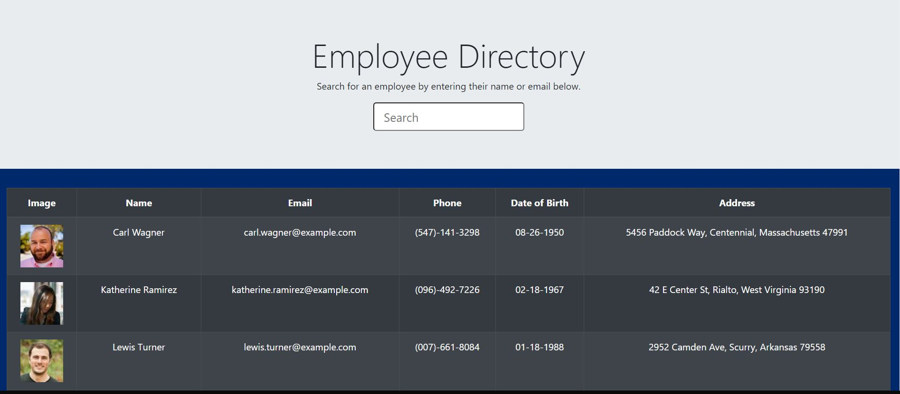

<h1 align="center"> PWA: Budget Tracker 👋</h1>

    
    
    
    
    
    </a>

    
    
    
    
    
    
    
    

## Description

🔍 This client-side application allows a user to quickly search for an employee's contact information, and will dynamically filter out employees as the user inputs keystrokes.  The employee list was populated by an API GET Request to https://randomuser.me.  This application was created with React and Bootstrap, and was based on a project prompt I received from the University of Minnesota's Full Stack Web Development Bootcamp.  I deployed this application's build folder to github using the "gh-pages" NPM package.

**[Deployed Application](https://ziwang55.github.io/employee-directory/)**

💻 Below is a screenshot of the application:
  

## Table of Contents
- [Description](#description)
- [Table of Contents](#table-of-contents)
- [Installation](#installation)
- [Usage](#usage)
- [Contributing](#contributing)
- [Questions](#questions)

## Installation
💾   

`npm install`
  
## Usage
💻   
  
`npm start`

## Contributing
:octocat: [Zi Wang](https://github.com/ZiWang55)

## Questions
✉️ Contact me with any questions: [email](mailto:ziwang55@gmail.com) , [GitHub](https://github.com/ZiWang55) 
